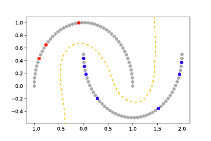

======================================

Shadow is a [PyTorch](https://pytorch.org/) based library for semi-supervised machine learning.
The `shadow` python 3 package includes implementations of Virtual Adversarial Training,
Mean Teacher, and Exponential Averaging Adversarial Training.
Semi-supervised learning enables training a model (gold dashed line) from both labeled (red and
blue) and unlabeled (grey) data, and is typically used in contexts in which labels are expensive
to obtain but unlabeled examples are plentiful.

For more information, go to [external]

Citing Shadow
--------------
* Linville, Lisa, et al. "Semi-supervised learning for seismic monitoring applications". In preparation. (2020).

License
-------
Revised BSD. See the LICENSE.txt file.

Contact
-------
* Dylan Anderson, Sandia National Laboratories, dzander@sandia.gov
* Lisa Linville, Sandia National Laboratories, llinvil@sandia.gov

Sandia National Laboratories is a multimission laboratory managed and operated by National Technology and Engineering Solutions of Sandia LLC, a wholly owned subsidiary of Honeywell International Inc. for the U.S. Department of Energy’s National Nuclear Security Administration under contract DE-NA0003525.
