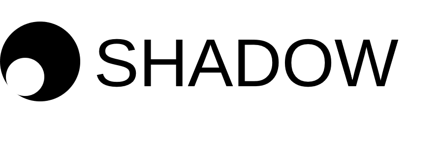

======================================

[](https://travis-ci.org/sandialabs/shadow)
[](https://coveralls.io/github/sandialabs/shadow?branch=master)
[](https://shadow-ssml.readthedocs.io/en/latest/?badge=latest)
[](https://pepy.tech/project/shadow-ssml)

Shadow is a [PyTorch](https://pytorch.org/) based library for semi-supervised machine learning.
The `shadow` python 3 package includes implementations of Virtual Adversarial Training,
Mean Teacher, and Exponential Averaging Adversarial Training.
Semi-supervised learning enables training a model (gold dashed line) from both labeled (red and
blue) and unlabeled (grey) data, and is typically used in contexts in which labels are expensive
to obtain but unlabeled examples are plentiful.


For more information, go to https://shadow-ssml.readthedocs.io/en/latest/

Installation
------------
Shadow can by installed directly from pypi as:
```
pip install shadow-ssml
```

Citing Shadow
--------------
* Lisa Linville, Dylan Anderson, Joshua Michalenko, Jennifer Galasso, Timothy Draelos; Semisupervised Learning for Seismic Monitoring Applications. Seismological Research Letters 2020;; 92 (1): 388–395. doi: https://doi.org/10.1785/0220200195

License
-------
Revised BSD. See the LICENSE.txt file.

Contact
-------
* Dylan Anderson, Sandia National Laboratories, dzander@sandia.gov
* Lisa Linville, Sandia National Laboratories, llinvil@sandia.gov

Sandia National Laboratories is a multimission laboratory managed and operated by National Technology and Engineering Solutions of Sandia LLC, a wholly owned subsidiary of Honeywell International Inc. for the U.S. Department of Energy’s National Nuclear Security Administration under contract DE-NA0003525.

Copyright
---------
Copyright 2019, National Technology & Engineering Solutions of Sandia, LLC (NTESS). Under the terms of Contract DE-NA0003525 with NTESS, the U.S. Government retains certain rights in this software.
