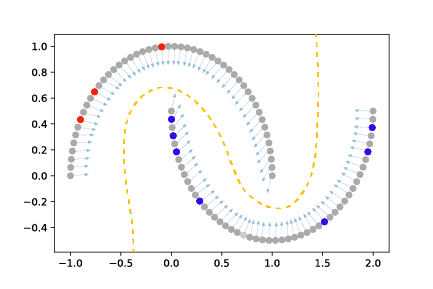
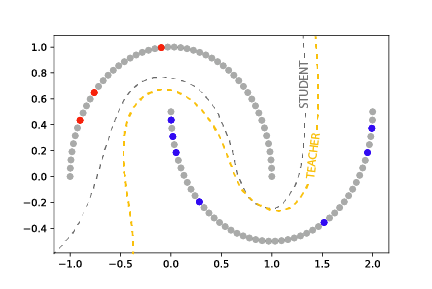
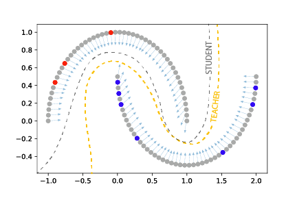

Overview
=====================

The ``shadow`` python package implements multiple techniques for semi-supervised learning.
Semi-supervised learning (SSL) enables training a model from both labeled and unlabeled data, and is typically
used in contexts in which labels are expensive to obtain but unlabeled examples are plentiful.
This is illustrated in :numref:`ssml-halfmoons`.
This package is built upon the `PyTorch <https://pytorch.org/docs/stable/index.html>`_ machine learning framework.

.. _ssml-halfmoons:
.. figure:: figures/ssml-halfmoons.png
    :align: center

    Semi-supervised learning uses both labeled (red and blue) and unlabeled (grey) data to
    learn a better model (gold dashed line).

Package Design
--------------

Semi-supervised techniques require two steps for integration into an existing supervised workflow.
First, the existing PyTorch model is wrapped using the desired technique, in this case Exponential Average
Adversarial Training (EAAT):

.. code-block:: python

    model = ...  # PyTorch torch.nn.Module
    eaat = shadow.eaat.Eaat(model)  # Wrapped model

Next, the loss function computation during training is modified to include a call to the wrapper-provided
`get_technique_cost`:

.. code-block:: python

    loss = criterion(x, y) + eaat.get_technique_cost(x)

Note that as posed in this code example, both labeled and unlabeled data are passed to the supervised
part of the loss function, `criterion`. The
`PyTorch CrossEntropyLoss <https://pytorch.org/docs/stable/nn.html#crossentropyloss>`_ provides an
`ignore_index` parameter. For samples without labels, `y` is set to this `ignore_index`. Other loss
functions can be modified to mask the mini-batch accordingly.

Consistency Regularization
--------------------------
Semi-supervised learning requires assumptions about the underlying data in order to make use of the
unlabeled data. The majority of techniques implemented in the ``shadow`` package are consistency
regularizers: they assume that the target variable changes smoothly over the data space. Said
another way: data points close to each other likely share the same label. To enforce this smoothness,
a consistency penalty is added to the overall loss function as:

.. math::

    \mathcal{L}(f_\theta(x_l), y_l) + \alpha g(f_\theta, x)

where :math:`\mathcal{L}` is the original loss function, :math:`(x_l, y_l)` represents labeled data,
:math:`f_\theta(x_l)` represents the predictions from model :math:`f_\theta`, :math:`\alpha`
represents a relative penalty weighting (hyperparameter), :math:`g` represents a consistency
enforcing function, and :math:`x` represents all data (labeled and unlabeled). Critically, the
consistency function depends upon input data but not the labels, which enables semi-supervised
learning. The specific form of :math:`g` and the mechanism by which it enforces consistency varies
between techniques.

Virtual Adversarial Training
++++++++++++++++++++++++++++
Virtual Adversarial Training [Miyato18]_ (VAT) enforces model consistency over small
perturbations to the input. Accordingly, the consistency term penalizes the difference between the
model output of the data and the model output of perturbed data:

.. math::

    g(f_\theta, x) = d(f_\theta(x), f_\theta(x + r_{adv}))

where :math:`d` represents some divergence function (typically mean squared error or
Kullback-Liebler divergence) and :math:`r_{adv}` represents a small data perturbation.
Instead of sampling perturbations :math:`r_{adv}` at random, VAT generates perturbations in the
virtual adversarial direction which corresponds to the direction of greatest change in model
output, enabling more effective regularization. This is illustrated in :numref:`vat-halfmoons`.

.. _vat-halfmoons:

    Virtual Adverarial Training [Miyato18]_ enforces consistency over perturbations to model input
    (shown as arrows). Pertubations are in the virtual adversarial direction, which represents the
    maximum change in model output.

Mean Teacher
++++++++++++

Mean Teacher [Tarvainen17]_ (MT) enforces consistency over model weights. MT builds on the idea
that averaging over training epochs (temporal ensembling) produces more stable predictions.
While temporal ensembling originally averaged the output values, [Tarvainen17]_ demonstrated
advantages and performance increases by using the exponential moving average (EMA) of the model
weights (denoted as the “teacher”) during training. Additionally, MT further assumes that
additive noise or realistic data augmentation should minimally affect current model predictions.
The consistency loss term for Mean Teacher is therefore:

.. math::

    g(f_\theta, x) = d(f_\theta(x + n), f_\theta'(x + n)

Where :math:`f_\theta'` (teacher) represents the weight-wise exponential moving average of the
model :math:`f_\theta` (student), and :math:`n` represents additive noise. This is illustrated in
:numref:`mt-halfmoons`.

.. _mt-halfmoons:

    Mean Teacher [Tarvainen17]_ enforces consistency over model weights between a student
    (grey dashed line) and a teacher (gold dashed line) model. The teacher model is the weight-wise
    exponential moving average during training of the student.

Exponential Averaging Adversarial Training
++++++++++++++++++++++++++++++++++++++++++

A natural extension of MT and VAT is to leverage the MT teacher-student framework but utilize
virtual adversarial perturbations to regularize the student. We denote this joint implementation
as Exponential Average Adversarial Training [Linville20]_ (EAAT). The consistency function is
given as:

.. math::
    g(f_\theta, x) = d(f_\theta(x + r_{adv}), f_\theta'(x))

This is illustrated in :numref:`eaat-halfmoons`.

.. _eaat-halfmoons:

    Exponential Averaging Adversarial Training [Linville20]_ combines both VAT and MT by enforcing
    consistency between a teacher and a student in which the student is given virtual adversarial
    perturbed data.

Practical Recommendations
-------------------------

The techniques in ``shadow`` were developed to test the performance of
various approaches to semi-supervised learning in a new application domain: seismic
waveform data. Although we primarily focus on classification, the
generalized framework provided here supports both classification and
regression tasks. Although all new datasets and techniques require significant investment in
tuning and optimization, for many of these SSL techniques we have
observed significant sensitivity to small changes in hyperparameter settings
and experiment set-up. Below, we offer some lessons learned for training and experiment setup
for these techniques.

Although VAT and EAAT seem to tolerate significant imbalance between
unlabeled and labeled data fractions per class, MT often learns best with a
50/50 labeled/unlabeled data fraction within each mini-batch. In the case of small label budgets
this implies significant oversampling of labeled data. In many of our experiments,
we found a consistency cost weighted at 2-4 times that of the class
loss enabled meaningful learning beyond simply fitting the label set.

For example, to weight the consistency cost:

.. code-block:: python

    loss = criterion(x, y) + weight * mt.get_technique_cost(x)

VAT, on the other hand, often trains longer under large label/unlabeled
fractions per batch, can tolerate a range of loss weights, but can be
sensitive to the perturbation amplitude (`xi`). We suggest `xi` be tuned in
advance of model training for new datasets to ensure the perturbation
amplitudes are not unreasonably large or converge to zero over
one power iteration. The `xi_check` parameter can be turned on to guide initial order of magnitude
studies in this regard. Likewise, the eigenvector estimation used to find virtual adversarial
directions yields a sign ambiguity: perturbations are often estimated in the negative of the
direction that provides the maximum change in model output. We provide a method to resolve the
direction ambiguity as a technique parameter: `flip_correction` (defaults
to `True`). If set to `False`, computation is faster but convergence may be slower as
competing directions may more closely resemble random perturbations.

EAAT has more complexity than MT or VAT alone; it requires consistency between
input and adversarially perturbed input on the exponential average model. Added
loss complexity often requires more extensive hyperparameter exploration. In our
experiments, this included the considerations mentioned above for both MT and VAT
and model depth, which appeared to limit SSL performance more than
fully-supervised learning in the same data regime using EAAT.

In [Linville20]_, we examine the performance between MT, VAT, and EAAT against
several baselines in a label-limited regime (where unlabeled data significantly
outweighs the labeled data quantity). In these experiments, SSL outperforms
baselines significantly. However, we also highlight that there is a
limit to SSL performance as the number of available labels increases. When
larger label fractions are available, SSL for our data can typically match but
not increase performance compared to fully-supervised models, but at the expense
of significantly more time spent on parameter optimization. One exception is
that adding even minimal quantities of unlabeled data from out-of-domain (OOD)
examples, in this case geographically, can positively impact prediction accuracy
on new OOD examples, even when the number of unlabeled OOD examples is small
compared to the number of labeled examples.

We hope the consistency-based SSL techniques provided here enable exploration on
a wide variety of problems and datasets. To get you started, we provide a simple
use example on MNIST available in :doc:`MNIST Example <examples/mnist_example>`.

